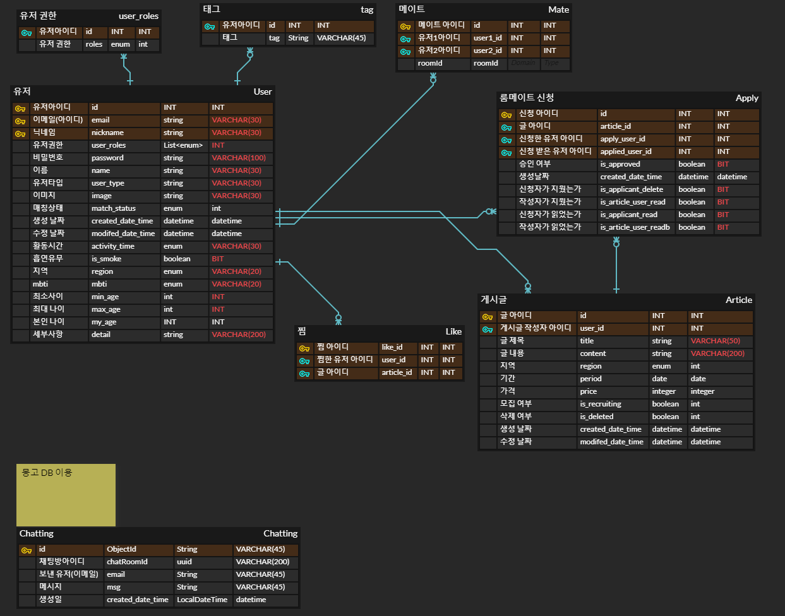
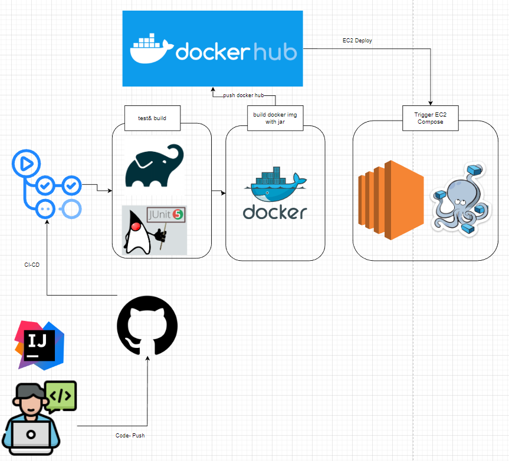
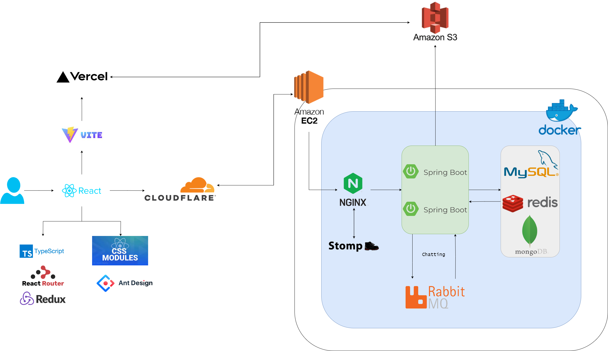

👨‍🚀 방갑고 : Room mate matching service
===
>
> 사회 초년생들이 사회에 첫 발을 내딛을 때, 주거비용은 상당한 부담으로 다가옵니다.
특히 월세나 전세금이 계속해서 높아지는 현실에서 혼자 주거비용을 감당하는 것은 새로운 지역으로 이동하거나 독립을 할 때 생각보다 많은 경제적 압박을 받게 됩니다.
> 저희팀에서는 이러한 문제를 해결하고자 하였습니다.

## ✨ 해결하고자하는 목표/ 서비스 
사회 초년생들이 사회에 첫 발을 내딛을 때, 주거비용은 상당한 부담으로 다가옵니다.
특히 월세나 전세금이 계속해서 높아지는 현실에서 혼자 주거비용을 감당하는 것은 새로운 지역으로 이동하거나 독립을 할 때 생각보다 많은 경제적 압박을 받게 됩니다.

이러한 문제를 해결하고자 주거비용을 공유할 수 있는 룸메이트를 매칭를 매칭할 수 있는 서비스를 기획하게 되었습니다.

**룸메이트 매칭 플랫폼 - 방갑고** 를 통해 사회 초년생들은 주거비용 부담을 줄이고, 적합한 룸메이트를 찾을 수 있습니다.

- 룸메이트 성향이 맞는 룸메이트 **자동 추천 기능 제공**
    - 사용자의 흡연 유무, 희망 연령대, 지역, 활동시간을 비교하고, MBTI 궁합까지 고려하여 최적의 룸메이트를 자동으로 추천해드립니다. 추천 시스템을 통해 사용자들은 자신과 성향이 비슷한 사람들을 쉽게 찾을 수 있습니다.
- 매칭이 완료되면 매칭된 **유저 채팅 기능 제공**
    - 매칭된 사용자들은 편리하게 1:1 채팅 기능을 이용하여 함께 주거 정보를 나누고 공유할 수 있습니다.
    이를 통해 매칭된 룸메이트들은 서로의 선호사항이나 규칙 등을 논의하고, 상호간의 소통을 원활하게 할 수 있습니다.
- **세분화된 검색 기능 제공**
    - 사용자는 원하는 지역, 기간, 보증금, 성별 정보를 기반으로 게시글을 검색하고 필터링할 수 있습니다. 또한, 모집 중인 글만 따로 보거나 마감된 글까지 전체로 보는 것이 가능합니다.
    이를 통해 사용자들은 자신의 선호사항에 맞는 룸메이트 구하는 게시글을 빠르게 찾을 수 있습니다.

## 🛠️ Skills & Tools :

- SpringBoot
- Java 11
- Docker
- Mysql
- Redis
- Mongo
- RabbitMQ
- Stomp
- JPA
- Jwt
- Docker
- DockerCompose
- AWS(EC2,S3)
- Nginx
- GithubAction

## 📚 Library:

- Swagger (Api doc)
- jwt(Json web token)
- JDBC(Mysql)
- Spring-data-Mongo(Chat-Log)
- Spring-data-Redis(Login)
- Spring-data-JPA
- Spring-Security
- Spring-Web
- Spring-WebFlux
- Lombok(Annotation)
- aws-cloud(S3)
- j-unit(test)
- Spring-amqp,Spring-websocket(Chat)
- Query-dsl
---

## 🗺️ ERD

---

## 🐋 CI-CD

---

## 📜 Project Architecture

---

## 👨‍👨‍👧‍👦Contributor

 

---

|역할|이름| 깃허브                                       | 업무  |
|---|---|-------------------------------------------|-----|
|BE|윤장원| [yjjjwww](https://github.com/yjjjwww)| 😃  |
|BE|서원호| [wonho-seo](https://github.com/wonho-seo)| ✨   |
|BE|고지민| [FeelingXD](https://github.com/FeelingXD) | 🐢  |

